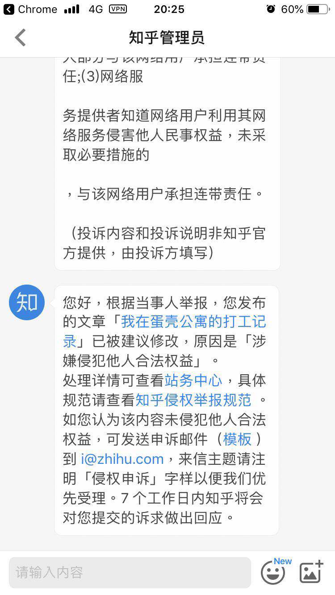
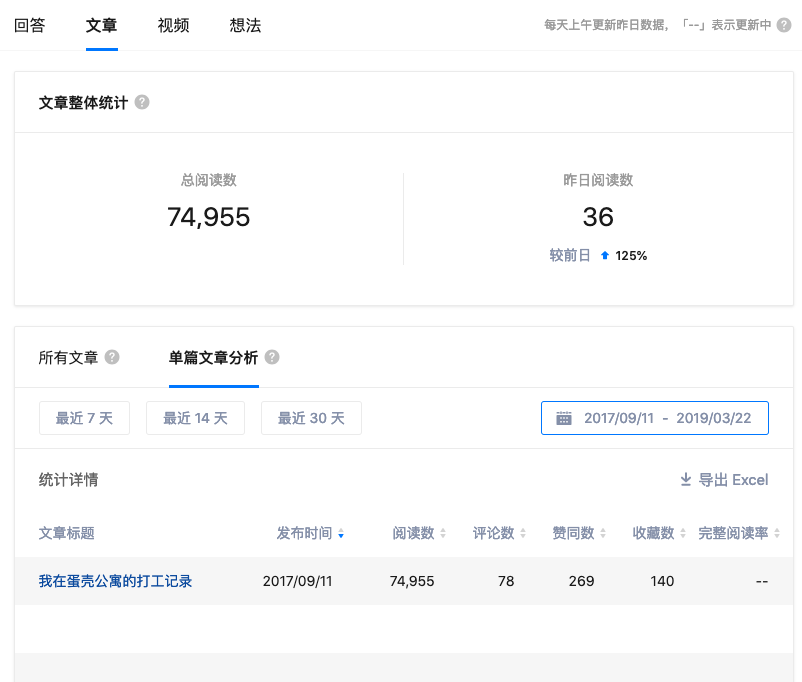
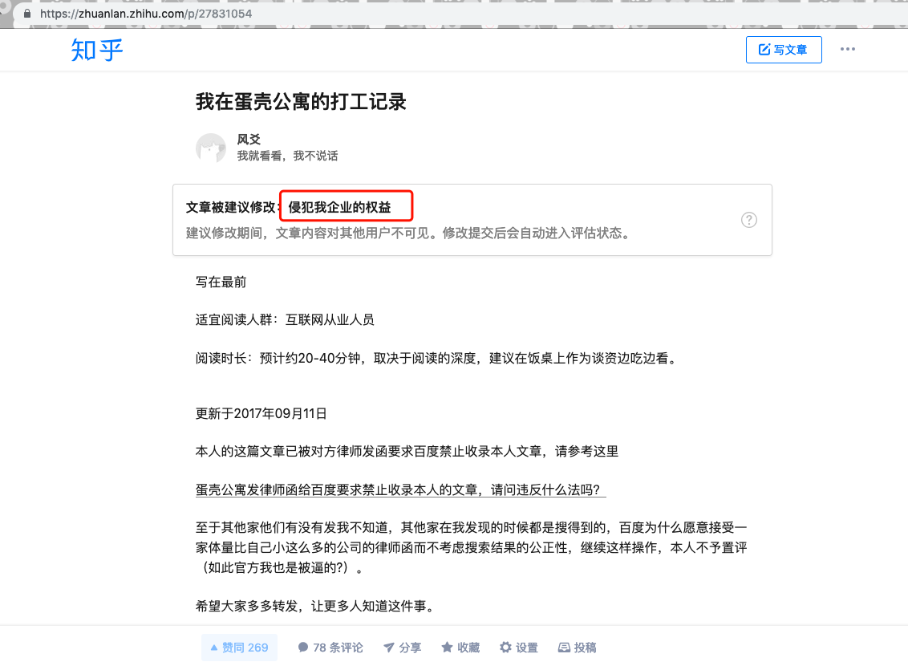

# 你好，蛋壳公寓 

[我在蛋壳公寓的打工记录](./aha-danke.md) 该文章从知乎迁移至此。

我一直相信一条古语：举头三尺有神明，不畏人知畏己知。

有段时间没上知乎，刚才打开后收到了被投诉举报的消息：

当然对于蛋壳公寓做出这种事，我并不意外，毕竟在2017年的时候，
他们为了不让这篇帖子被更多人看到，也是想尽各种办法。
比如：通过联系百度，用搜索引擎禁止收录的方式，防止更多的人知道。
[某平台发律师函给百度要求禁止收录本人的文章，请问违反什么法吗？](https://www.zhihu.com/question/64927885)

有趣的是，他们这么努力的联系各大平台，防止我的文章被收录，
就是不与作为当事人的我作为蛋壳公寓前员工的我联系，这种操作也是厉害。
让我也算领会到了大概公关就是这样意思吧。

我反倒要谢谢知乎的坚挺，
从2017年蛋壳公寓的A+轮融资，一直扛到了他们2019年C轮融资。
看看人家百度同学，2017年就禁止收录了这篇文章了！
我还是挺佩服百度的敏捷的，不愧是要进军医疗相关行业的公司，
在控制搜索结果上很到位，区区小个体也能精准的屏蔽。

从现在的数据统计看，7万+的阅读量，我的目的也算达到了。
如果知乎统计的没错的话，那我发现的还算及时😂，好像是今天刚刚生效的，昨天还有阅读量。

当我写这篇文章的时候，我也很清楚，资本市场是无情的，
一个小个体，并不能撼动什么。

绝大多数资本不会在乎一个员工怎么样；
绝大多数资本不会在乎没有写在合同上的任何东西；
绝大多数资本不会在乎投资的行业对社会有没有危害；
绝大多数资本只在乎能不能赚钱，能不能赚很多钱。

但我也相信另一条真理，资本无情，人有情。
不是所有人都是资本家，也不是所有资本家都是冷血思维只在乎赚钱。

我相信守信是人珍贵的品德，
古人有 "君子一言驷马难追。"
国外有 "Make Your Word Gold."
即使在现代商业社会，对于承诺，也有法律上的意义：

>  涉及到要约需要履行的条款
>
>  《中华人民共和国合同法》
>  
>  第十四条    要约是希望和他人订立合同的意思表示，该意思表示应当符合下列规定：
>  
>          （一）内容具体确定；
>  
>          （二）表明经受要约人承诺，要约人即受该意思表示约束。
>  
>  第十九条    有下列情形之一的，要约不得撤销：
>  
>          （一）要约人确定了承诺期限或者以其他形式明示要约不可撤销；
>  
>          （二）受要约人有理由认为要约是不可撤销的，并已经为履行合同作了准备工作。
>  
>  第二十一条    承诺是受要约人同意要约的意思表示。
>  
>  第四十五条    当事人对合同的效力可以约定附条件。附生效条件的合同，自条件成就时生效。附解除条件的合同，自条件成就时失效。 当事人为自己的利益不正当地阻止条件成就的，视为条件已成就；不正当地促成条件成就的，视为条件不成就。
>  
>  第六十二条    当事人就有关合同内容约定不明确，依照本法第六十一条的规定仍不能确定的，适用下列规定：
>  
>          （四）履行期限不明确的，债务人可以随时履行，债权人也可以随时要求履行，但应当给对方必要的准备时间。
>  
>  第一百零八条    当事人一方明确表示或者以自己的行为表明不履行合同义务的，对方可以在履行期限届满之前要求其承担违约责任。
>  
>  

在这里我要特别"感谢"这位叫做虞冰（小排）的前同事，蛋壳公寓的前任监事。
从入职时看朋友的份上，不跟你敲定明确的期权数字，我就傻呵呵的陪你创业。
就因为这些不明朗的条件，家里当时也没少闹矛盾，你也是知道的。
你的说法是："期权保证一定不会少"。
在我没有截图的情况下，你现在还会承认说过这句话吗？

再到后来截图里的20万期权的承诺，以及最后蛋壳公寓约谈本人离职前索要本人家长家庭住址的神奇操作，
最后到底是不是我之前的合同地址填写不全所以才需要我的家庭住址？到现在都无法证实，
毕竟合同我没拿到，而我们国家的法律、相关的部门（至少是我找过的部门）也只管有没有签合同，而不管签了合同后，企业有没有给你。

不过事情过去也差不多两年多了，人要向前看，
没必要太计较根本不曾得到的东西，
也没必要纠结那么多无法证实的东西浪费时间。

本来大路朝天，各走一边，从此相"望"于江湖，还是挺好的结局。

不过蛋壳公寓这家公司看来很在乎我写的这篇文章，知道你们这么惦记我，
那我就放心了，谢谢你们，蛋壳公寓！

侵犯了你企业的权益？ 真有趣，我也觉得我的权益被侵犯了。

这一次，欢迎你们公关Github团队。不过我猜常见策略应该还是"百度禁止收录了解一下"？
这次希望你们能及时的公关搜搜，必应，google 等团队，人家的市场份额也不小，
再说，我主要是写给程序员群体还有尽调机构看的。
优秀的程序员都是用 google 的好吗？
优秀的咨询机构也是用 google 的好吗？

我也一点都不介意再多来一些付费咨询，
只要是不违反蛋壳公寓与本人约定的保密条款的东西，我必知无不言言无不尽。

作为程序员个体，我的声音是渺小的。
而我能做的就是客观的描述记录，让更多的人知道，
蛋壳公寓对待员工还是拿过"优秀员工奖"的程序员是怎么样的，即便这可能只是个例。

我只提供基于事实的描述，截图、视频等等。
我相信能帮助一些人更全面的了解蛋壳公寓是一家怎样的公司。
怎么看待这件事是各位读者的事情，我要不要发声那是我的事情。

回想起去年蛋壳公寓走入公众视野的那些事件，
我有时候会想以这样的方式离开蛋壳公寓或许还算个不错的结局。
印象中是我爱我家副总裁胡景晖离职前后曝光了这些事件，有兴趣可以自行搜索。
随便找了一篇 [房租原地暴涨200%！自如、相寓、蛋壳公寓被约谈](http://zj.ifeng.com/a/20180819/6816367_0.shtml)

我要特别"谢谢"蛋壳公寓的创始人团队，虞冰、高靖、崔岩。
哦对了，还有在微博提问就直接把我拉黑的沈博阳。
以前我对创业的观点是："朋友是朋友，生意是生意。千万不能掺杂感情。"
任何利益点一定要落实到合同上，
这是是唯一一次相信朋友的创业项目，也不在乎什么情怀，理想。
你觉得好，我就帮你，仅此而已。

这也绝对不是我现在事后的马后炮，
摘自当年的一篇招人软文
[创业，是一种生活态度](https://www.v2ex.com/t/295005)，也算是无心插柳。
知道了现在的蛋壳公寓，我，会心一笑。

> 从事情上看，在外行人眼中，几乎所有人都觉得我们是二房东，是的我们在你们眼中很 Low ，但我们做的东西未必 Low 。我们内心还是拒绝这个称呼的好吗？我只喜欢站着还能把钱赚了的生意，这件事情从内心讲我并不认为足够的高尚，但是在国情下，这绝对是一种合理的解决方案。在这个越来越多的年轻人涌入到北上广深谋出路的时代，帮他们住的好一点，我们也赚一些钱，对彼此都不是坏事。

经历过蛋壳公寓这次的事件，我的答案是：我以前的想法太对了！！！！

还有，创业要看项目，没逼格的项目千万不要做。

[我在蛋壳公寓的打工记录](./aha-danke.md)

